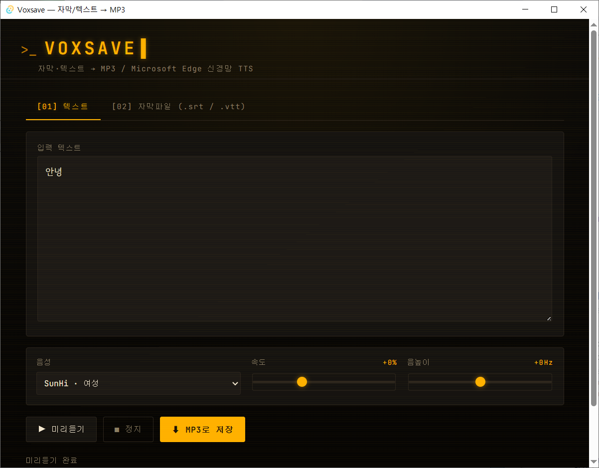

# 한국어 TTS, 더 이상 돈 들이지 마세요 — Voxsave 30초 사용법



> **요약**: 자막 파일(.srt/.vtt)이나 글 한 토막을 **Microsoft Edge 신경망 음성**으로 MP3로 만들어주는 무료 Windows 앱입니다. 가입·로그인·API 키 전부 없음. 12MB 인스톨러 한 개로 끝.

## 이런 분들께

- 유튜브 영상에 **한국어 더빙**이 필요한데 성우 비용은 부담스러운 크리에이터
- 강의 자료, 발표 자료, 안내 멘트에 **자연스러운 음성 내레이션**을 넣고 싶은 분
- 영어 자막을 한국어로 번역한 뒤 **음성으로 더빙**하고 싶은 콘텐츠 제작자
- 시각장애가 있는 가족·동료를 위해 **글을 음성으로 변환**해 전달하고 싶은 분
- **오디오북·팟캐스트 시제품**을 만들고 싶은 작가, 학생

기존 무료 TTS는 한국어 발음이 어색하거나, 글자 수 제한이 있거나, 회원가입을 요구합니다. Voxsave는 셋 다 해당 없습니다.

---

## 30초 첫 사용

### 1. 다운로드 & 설치

[GitHub Releases](https://github.com/cflab2017/Tool_Voxsave/releases/latest) 에서 `Voxsave_0.1.0_x64-setup.exe` 받기 → 더블클릭.

> "Windows에서 PC를 보호했습니다" 경고가 뜨면 **추가 정보 → 실행**을 누르세요. 코드 서명 안 된 무료 앱이라 정상입니다. 12MB짜리 한 파일이고, 추가로 받아오는 건 WebView2 정도(이미 깔린 분이 대부분).

### 2. 텍스트를 MP3로 만들기

1. 시작 메뉴에서 **Voxsave** 실행
2. 입력란에 변환할 문장 입력
3. **▶ 미리듣기**로 음성 확인
4. **⬇ MP3로 저장** → 위치 선택 → 끝

```
이 영상은 Voxsave로 한 번에 만들었습니다.
구독과 좋아요 부탁드립니다.
```

위 문장이 3초 안에 자연스러운 한국어 MP3가 됩니다.

### 3. 자막 파일을 통째로 더빙

1. 상단 탭 **[02] 자막파일 (.srt / .vtt)** 클릭
2. 자막 파일을 창에 **드래그앤드롭** (또는 박스 클릭해서 선택)
3. 타임코드·번호·HTML 태그가 자동으로 제거되고 대사만 추출됨
4. **MP3로 저장**

자막에 `<i>`, `<font>` 같은 태그가 들어 있어도 깨끗이 정리됩니다. Aegisub의 `{\an8}` 같은 ASS 스타일 태그도 자동 제거.

---

## 음성·속도·음높이 조절

| 컨트롤 | 옵션 | 메모 |
|---|---|---|
| **음성** | 한국어 3종(SunHi 여성, InJoon 남성, Hyunsu 다국어), 영·일·중 추가 | 기본값 SunHi가 가장 자연스러움 |
| **속도** | -50% ~ +100% | 학습용은 -10%, 빠른 리뷰는 +30% 권장 |
| **음높이** | -50Hz ~ +50Hz | 캐릭터 보이스 만들 때 ±20Hz 정도 |

**미리듣기는 저장 결과와 같은 음질**입니다. 미리듣기에서 마음에 들면 그대로 저장됩니다.

---

## 활용 예시

### 유튜브 영상 더빙
1. 자막 파일(.srt) 준비
2. 자막 탭에 드래그 → SunHi 음성, +5% 속도로 저장
3. 결과 MP3를 영상 편집 프로그램(프리미어/다빈치)에 음성 트랙으로 추가

### 발표·강의 안내 멘트
짧은 문장을 여러 개 만들어 안내 멘트 풀로 사용. 매번 녹음할 필요 없음.

### 학습 자료
영어 본문을 InJoon(남성) 음성으로 만들어 출퇴근 시간에 청취.

### 오디오북·팟캐스트 시제품
대본을 통째로 입력해 첫 회차 데모 제작. 출연료 0원.

---

## 자주 묻는 질문

**Q. 인터넷 없이 쓸 수 있나요?**
미리듣기·MP3 저장은 인터넷이 필요합니다 (Microsoft Edge TTS 서버 호출). 앱 자체는 오프라인이지만 음성 합성은 클라우드에서 처리됩니다.

**Q. 글자 수 제한이 있나요?**
edge-tts 자체에는 사실상 제한이 없습니다. 자막 한 편(예: 영화 자막 1500줄)도 한 번에 변환 가능.

**Q. 상업적으로 써도 되나요?**
Microsoft Edge TTS의 약관을 따릅니다. 일반적으로 개인·상업 콘텐츠에 사용 가능하지만, 큰 프로젝트 전에는 Microsoft 공식 라이선스 페이지를 한 번 확인하세요.

**Q. Mac이나 리눅스 버전은요?**
현재 Windows 전용입니다. macOS/Linux는 향후 빌드 예정.

**Q. 음성이 잘려 나옵니다.**
긴 텍스트는 마지막 마침표 뒤에 빈 줄 한두 줄을 추가해 보세요. 또는 문단 단위로 나눠 저장 후 합치는 방식이 안전합니다.

---

## 시스템 요구사항

- Windows 10 (1803+) 또는 Windows 11
- WebView2 (Win11 기본, 없으면 자동 설치)
- 인터넷 연결 (MP3 생성 시)

총 설치 용량 약 25MB, 메모리 사용량 50~100MB.

---

## 지금 받기

**[👉 Voxsave_0.1.0_x64-setup.exe 다운로드](https://github.com/cflab2017/Tool_Voxsave/releases/latest)**

소스코드·이슈 제보: [github.com/cflab2017/Tool_Voxsave](https://github.com/cflab2017/Tool_Voxsave)

질문이나 기능 제안은 GitHub Issues에 남겨주세요. 다음 버전은 자동 음성 캐싱 + 일괄 변환 큐를 검토 중입니다.
